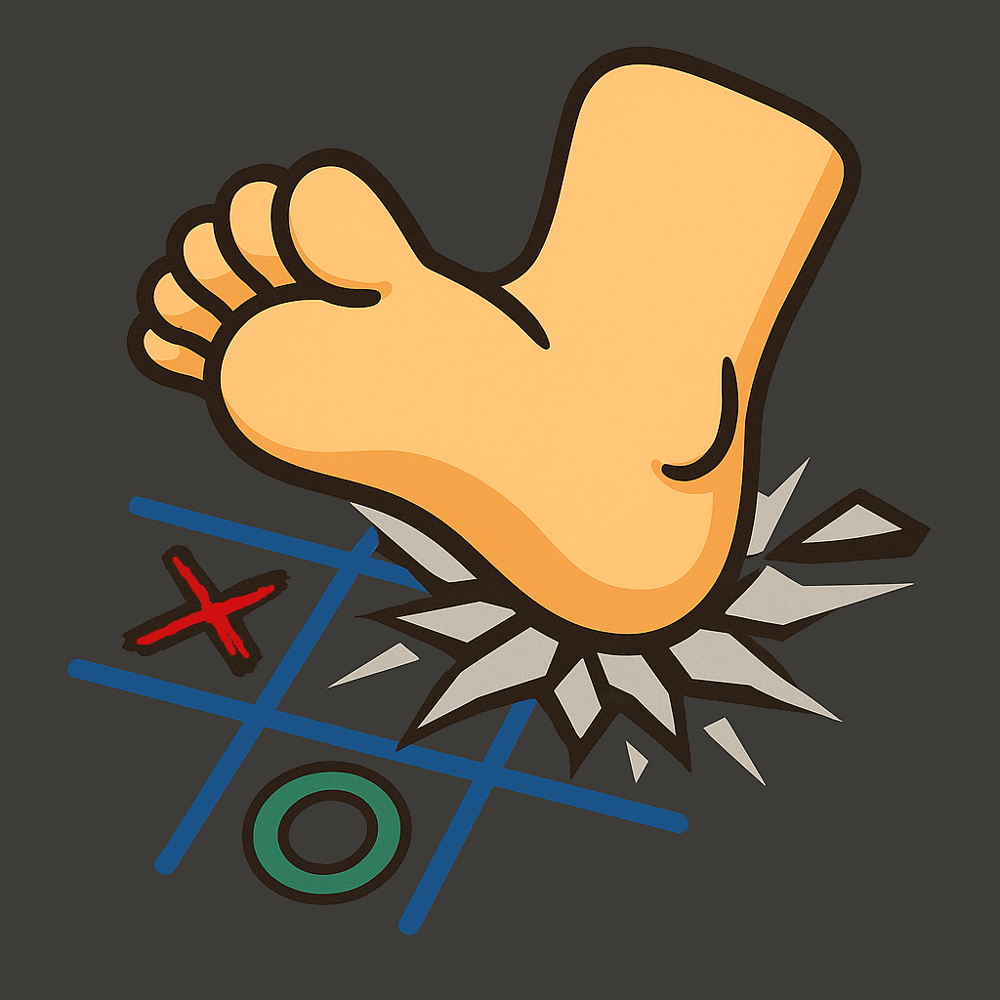
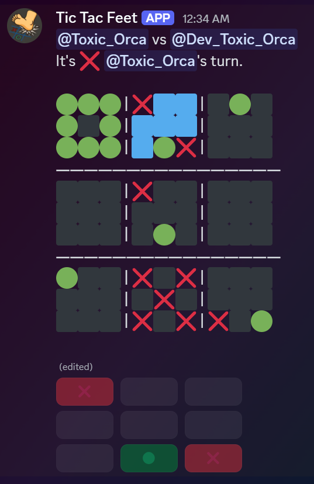

<table>
  <tr>
    <td></td>
    <td><h1>Tic-Tac-Feet  A Discord Bot Game</h1></td>
  </tr>
</table>

Tic-Tac-Feet is a fun, multiplayer Discord bot game based on a twist of Tic-Tac-Toe — where players battle over 9 boards on one mega board. Each move determines where your opponent can play next. First to claim 3 small boards in a row wins the game!

---

## 🎮 Features

- Multiplayer 1v1 gameplay
- Button-based interactive game UI
- Auto win detection & game over messaging
- Emoji-based visual board display
- Blue squares show active board
- Channel-specific restrictions (can only be played in `#tic-tac-feet`)
- / commands with autofill

# 📷 Preview

---

## 🚀 Getting Started

1. Clone the Repository `git clone https://github.com/ToxicOrca/Tic-Tac-Feet.git`
2. Install Dependencies ` pip install -U discord.py`
3. Create Discord text channel named `tic-tac-feet`
4. Create a file named discord_secrets.py and add: `DISCORD_TOKEN = "YOUR_DISCORD_BOT_TOKEN"`
5. Invite your bot to your server. (See Permissions)
6. Run the bot: `python tic_tac_feet` 

# 🔧 Requirements
- Python 3.10+
- discord.py 2.3+
- A Discord bot token and bot invited to your server

# 🛠 Commands
Command	Description
- `/play` @user	Starts a new game with the mentioned user
- `/resign`	Resign your current match and let your opponent win

# 🔒 Bot Permissions
When inviting the bot to your server, make sure it has the following permissions:

BOT:
- SERVER MEMBERS INTENT
- MESSAGE CONTENT INTENT

OAuth2:
- bot
- application.commands

# 📜 License
This project is open-source and released under the MIT License.
Feel free to modify, share, or fork it!

**App Icon**: AI-generated with assistance from OpenAI's ChatGPT. Free to use and distribute under the same license as this project.

This project was developed with the assistance of OpenAI's ChatGPT.

# ❤️ Contributing
If you find a bug or have an idea, feel free to open an issue.

